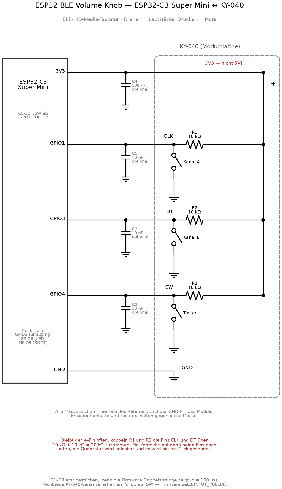

# ESP32 BLE Volume Knob

A rotary knob based on the **ESP32-C3 Super Mini** that registers with an
Android phone over Bluetooth LE as an HID media keyboard ("VolKnob") and
controls the media volume.

- **Turn clockwise** → `KEY_MEDIA_VOLUME_UP`
- **Turn counter-clockwise** → `KEY_MEDIA_VOLUME_DOWN`
- **Press the button** → `KEY_MEDIA_MUTE`

No app is required on the phone; Android handles the HID consumer control
codes natively. The ESP32-C3 is powered over USB-C.

## Requirements

- ESP32-C3 Super Mini (or any other C3 board with native USB Serial/JTAG)
- **KY-040** rotary encoder with push-button (4 quadrature steps per detent)
- 5 wires; optionally 3× 10 nF for hardware debouncing and 1× 100 nF for
  supply decoupling
- [PlatformIO](https://platformio.org/) to build

## Wiring

| KY-040 | ESP32-C3 |
| --- | --- |
| CLK | GPIO1 |
| DT | GPIO3 |
| SW | GPIO4 |
| + | **3V3** |
| GND | GND |

**Why CLK goes to GPIO1 and not GPIO2.** The KY-040 header `CLK·DT·SW·+·GND`
lines up exactly with pads 2–6 of the right rail (GND, 3V3, GPIO4, GPIO3,
GPIO2), the only position where GND and 3V3 are adjacent and therefore the
only orientation that can be soldered on directly. That places CLK on GPIO2,
which is a strapping pin: if the knob rests between two detents at power-up,
the CLK contact pulls GPIO2 low and the board does not boot. A pull-up strong
enough to hold GPIO2 high at boot also makes the encoder signal unreadable in
normal operation, so CLK is wired to GPIO1 (pad 7) instead and GPIO2 is left
unused.

Also leave `GPIO9` (BOOT) and `GPIO8` (LED) unused.

**Supply from 3.3 V, not 5 V.** The 10 kΩ pull-ups of the KY-040 are tied to
the module's `+` pin, so a 5 V supply would put 5 V on the C3 GPIOs. Leave the
5V pin unconnected. The firmware still configures `INPUT_PULLUP` because not
every KY-040 variant has a module pull-up on `SW`.

**Keep the antenna clear.** The antenna of the Super Mini sits at the end
opposite the USB-C connector. Do not place the encoder board over it; doing so
reduces BLE range.

### Schematic



The drawing also shows the internals of the KY-040 module board: R1–R3 are the
pull-ups **on the module**, tied to its `+` pin. The encoder contacts and the
push-button switch against the module's GND pin, which is why every ground
symbol inside the dashed frame is the same connection.

C1–C3 (10 nF) are optional hardware debouncing: build without them first and
only add them if the firmware shows double steps. Together with the 10 kΩ
module pull-up they give τ ≈ 100 µs. C4 (100 nF) decouples the module supply.

The drawing is generated from [`docs/schaltplan.py`](docs/schaltplan.py) using
[schemdraw](https://schemdraw.readthedocs.io/):

```bash
python docs/schaltplan.py     # writes docs/schaltplan.svg + .png
```

## Build and flash

```bash
pio run              # build
pio run -t upload    # flash
```

The C3 Super Mini enumerates as a serial port over USB Serial/JTAG
(VID `303A` / PID `1001`); no BOOT button is needed. The upload port can be
pinned down in `platformio.ini` if several boards are attached.

Footprint: roughly 500 kB of flash out of 3.1 MB (partition scheme `huge_app`)
and just under 24 kB of RAM.

The BLE HID layer comes from
[T-vK/ESP32-BLE-Keyboard](https://github.com/T-vK/ESP32-BLE-Keyboard) in its
**NimBLE flavour** (`-DUSE_NIMBLE`); the Bluedroid version quickly exceeds the
available flash on the C3.

## Pairing

Android → Bluetooth → select "VolKnob" → connect. No PIN.

## Troubleshooting

### Nothing happens even though the encoder turns mechanically

The most likely cause is that the **`+` wire (3V3) has no contact**. The
symptoms look like a firmware bug but are a wiring fault:

- CLK and DT always change *together*, only 1–2 µs apart in a microsecond
  trace, which is mechanically impossible.
- The quadrature table therefore sees the transition `11 → 00`, which is index
  3 and index 12, both `0`. Every step is discarded, `encDelta` stops moving,
  and no click is ever sent.
- On top of that, dozens of microsecond-scale edges appear per detent.

Reason: the two 10 kΩ pull-ups of the module are tied to the `+` node. If that
node floats, they connect CLK and DT through 10 k + 10 k = **20 kΩ**. When a
contact pulls CLK to ground, DT is dragged along through those 20 kΩ against
the C3's internal 45 kΩ pull-up:

```
U_DT = 3.3 V × 20k / (20k + 45k) ≈ 1.0 V   → below the logic threshold → reads 0
```

### Checking the module supply without a multimeter

Read the pin twice, once with the internal pull-up and once with the internal
pull-down:

```cpp
pinMode(pin, INPUT_PULLUP);   delayMicroseconds(500); int up   = digitalRead(pin);
pinMode(pin, INPUT_PULLDOWN); delayMicroseconds(500); int down = digitalRead(pin);
pinMode(pin, INPUT_PULLUP);
```

| pull-up | pull-down | meaning |
| --- | --- | --- |
| 1 | 1 | external pull-up present — module is connected to 3V3 |
| 1 | 0 | floating — **no** external pull-up |
| 0 | 0 | tied to ground — contact closed |

The internal pull-down is around 45 kΩ, so the 10 kΩ module pull-up wins
clearly against it. This shows whether the supply actually reaches the module
without needing a meter.

### Observing the events on the Android device

```bash
adb shell dumpsys bluetooth_manager | grep -A3 VolKnob   # bond state and Hogp profile
adb shell getevent -p | grep -A6 VolKnob                 # HID device, e.g. /dev/input/event8
adb shell settings get system volume_music               # 0..15
adb logcat -v time | grep "applyVolumeRow 3:"            # LEVEL/MUTED per change
```

Redirecting `getevent -lt` through `adb shell` into a file does not work; the
output is buffered and never arrives. `logcat` and `settings get` are the
reliable way.

### Other pitfalls

- **Verify the module pinout.** There are KY-040 variants with
  `GND·+·SW·DT·CLK` and other orders. With 3.3 V wired straight to the module,
  a swap is not forgiving.
- **Direction inverted:** swap `PIN_CLK` and `PIN_DT` in the code.
- **Double steps per detent:** set `DETENT_STEPS` to 2 or 1, depending on the
  detent scheme of the specific encoder.
- **Mute has no effect:** some Android versions ignore `KEY_MEDIA_MUTE` for the
  media stream. Fallback: track the volume on the ESP32, ramp it to 0 on the
  first press and back up on the second. On a Galaxy A16 (SM-A165F)
  `KEY_MEDIA_MUTE` works directly.
- **Reconnecting after the phone locks** takes a few seconds, which is normal
  for BLE.
- Turning while the phone is still establishing the connection has no effect;
  there is no wakelock.

## Enclosure

A round desktop puck, Ø54.2 × 20.9 mm with the default dimensions: parametric
OpenSCAD source and exported STLs in [`case/`](case/). The KY-040 is clamped by
its own M7 bushing nut against the top face, the ESP32-C3 slides into rails,
and a bottom plate closes it with three M3 screws.

The dimensions are nominal rather than measured from my own parts, so check
them before printing the full case; [`case/README.md`](case/README.md) lists
which ones matter and ships a fit-test coupon that prints in a few minutes.

## Tested with

ESP32-C3 Super Mini, KY-040, Samsung Galaxy A16 (SM-A165F): 5 detents
clockwise raise the media volume from 7 to 12, 5 detents back return it to 7,
one step per detent with no dropped clicks.
