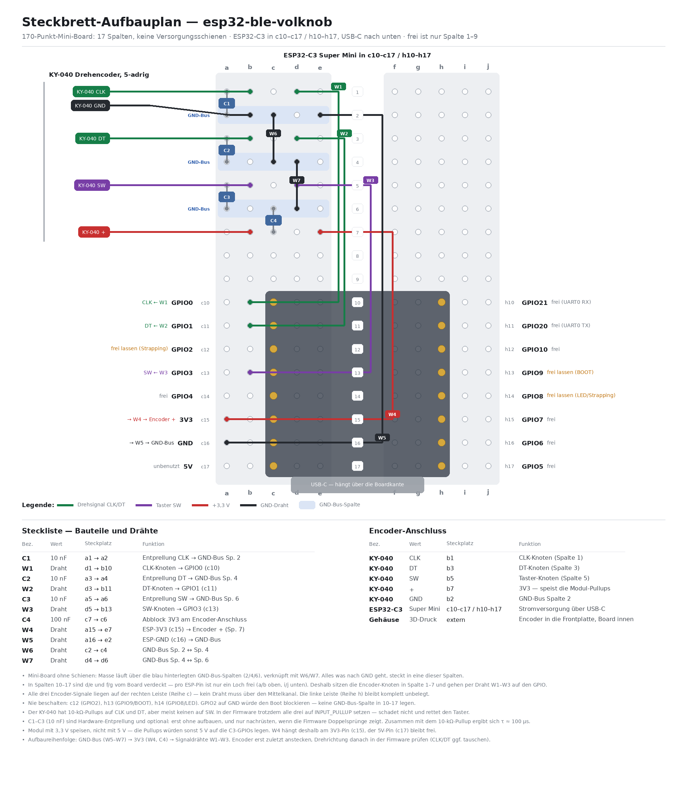

# ESP32 BLE Volume Knob

Drehregler auf **ESP32-C3-Super-Mini**-Basis, der sich per Bluetooth LE als
HID-Media-Tastatur („VolKnob") beim Android-Handy anmeldet und die
Medienlautstärke steuert.

- **Drehen im Uhrzeigersinn** → `KEY_MEDIA_VOLUME_UP`
- **Drehen gegen den Uhrzeigersinn** → `KEY_MEDIA_VOLUME_DOWN`
- **Taster drücken** → `KEY_MEDIA_MUTE`

Keine App auf dem Handy nötig — Android verarbeitet die
HID-Consumer-Control-Codes nativ. Versorgung über USB-C am ESP32-C3.

## Voraussetzungen

- ESP32-C3 Super Mini (oder anderes C3-Board mit nativem USB-Serial/JTAG)
- Drehencoder **KY-040** mit Taster (4 Quadratur-Schritte pro Raste)
- 5 Adern; optional 3× 10 nF für Hardware-Entprellung, 1× 100 nF Abblock
- [PlatformIO](https://platformio.org/) zum Bauen

## Verdrahtung

| KY-040 | ESP32-C3 |
| --- | --- |
| CLK | GPIO1 |
| DT | GPIO3 |
| SW | GPIO4 |
| + | **3V3** |
| GND | GND |

**Warum CLK auf GPIO1 und nicht auf GPIO2.** Die KY-040-Stiftleiste
`CLK·DT·SW·+·GND` passt geometrisch genau auf Pad 2–6 der rechten Leiste
(GND, 3V3, GPIO4, GPIO3, GPIO2) — die einzige Stelle, an der GND und 3V3
benachbart liegen, also die einzige direkt lötbare Ausrichtung. CLK läge dann
aber auf GPIO2, und das ist ein Strapping-Pin: steht der Knopf beim Einstecken
zwischen zwei Rasten, zieht der CLK-Kontakt GPIO2 auf Masse und das Board
bootet nicht. Kein Widerstand löst das — was GPIO2 beim Boot oben hält, macht
das Signal im Betrieb unlesbar. Deshalb geht CLK per Draht auf GPIO1 (Pad 7),
GPIO2 bleibt frei.

Ebenfalls frei lassen: `GPIO9` (BOOT) und `GPIO8` (LED).

**Speisung mit 3,3 V, nicht 5 V.** Die 10-kΩ-Pullups des KY-040 hängen am
`+`-Pin des Moduls; mit 5 V lägen 5 V auf den C3-GPIOs. Der 5V-Pin bleibt frei.
Die Firmware setzt trotzdem `INPUT_PULLUP` — nicht jede KY-040-Variante hat
einen Modul-Pullup auf `SW`.

**Antenne freihalten:** Die Antenne des Super Mini sitzt am USB-C-Ende. Die
Encoder-Platine nicht darüber legen, das kostet BLE-Reichweite.

### Steckbrett-Prototyp



Der abgebildete Prototypenaufbau nutzt eine **abweichende Belegung** —
CLK auf GPIO0, DT auf GPIO1, SW auf GPIO3 —, damit alle drei Signale auf der
rechten Leiste liegen und kein Draht über den Mittelkanal muss. Für diesen
Aufbau die `PIN_*`-Defines in `src/main.cpp` entsprechend ändern.

C1–C3 (10 nF) sind Hardware-Entprellung und optional: erst ohne aufbauen, nur
nachrüsten, wenn die Firmware Doppelsprünge zeigt. Mit dem 10-kΩ-Modul-Pullup
ergibt sich τ ≈ 100 µs.

## Bauen und flashen

```bash
pio run              # bauen
pio run -t upload    # flashen
```

Der C3 Super Mini meldet sich über USB-Serial-JTAG als serieller Port
(VID `303A` / PID `1001`), ein BOOT-Taster wird nicht gebraucht. Der
Uploadport steht in `platformio.ini` und muss ggf. angepasst werden.

Verbrauch: rund 500 kB Flash von 3,1 MB (Partitionsschema `huge_app`) und
knapp 24 kB RAM.

Die BLE-HID-Anbindung kommt von
[T-vK/ESP32-BLE-Keyboard](https://github.com/T-vK/ESP32-BLE-Keyboard) in der
**NimBLE-Variante** (`-DUSE_NIMBLE`) — die Bluedroid-Version sprengt auf dem C3
schnell den Flash.

## Koppeln

Android → Bluetooth → „VolKnob" auswählen → verbinden. Kein PIN.

## Fehlersuche

### Es passiert gar nichts, obwohl der Encoder mechanisch dreht

Wahrscheinlich hat die **`+`-Ader (3V3) keinen Kontakt**. Das Fehlerbild sieht
wie ein Firmware-Bug aus, ist aber Verdrahtung:

- CLK und DT wechseln immer *gemeinsam*, im µs-Trace nur 1–2 µs auseinander —
  mechanisch unmöglich.
- Die Quadratur-Tabelle sieht dadurch den Sprung `11 → 00`, also Index 3 bzw.
  12, beides `0`. Jeder Schritt wird verworfen, `encDelta` bleibt stehen, es
  wird nie ein Click gesendet.
- Dazu µs-Geprassel mit dutzenden Flanken pro Raste.

Ursache: Die beiden 10-kΩ-Pullups des Moduls hängen am `+`-Knoten. Floatet der,
verbinden sie CLK und DT über 10 k + 10 k = **20 kΩ miteinander**. Zieht ein
Kontakt CLK auf Masse, hängt DT passiv mit dran und kämpft nur gegen den
internen 45-kΩ-Pullup des C3:

```
U_DT = 3,3 V × 20k / (20k + 45k) ≈ 1,0 V   → unter der Logikschwelle → liest 0
```

### Speisung am Modul prüfen, ohne Multimeter

Den Pin einmal mit internem Pullup und einmal mit internem Pulldown lesen:

```cpp
pinMode(pin, INPUT_PULLUP);   delayMicroseconds(500); int up   = digitalRead(pin);
pinMode(pin, INPUT_PULLDOWN); delayMicroseconds(500); int down = digitalRead(pin);
pinMode(pin, INPUT_PULLUP);
```

| pullup | pulldown | Bedeutung |
| --- | --- | --- |
| 1 | 1 | externer Pullup vorhanden — Modul hängt an 3V3 |
| 1 | 0 | offen/floatend — **kein** externer Pullup |
| 0 | 0 | fest auf GND — Kontakt geschlossen |

Der interne Pulldown liegt bei rund 45 kΩ; gegen den 10-kΩ-Modul-Pullup
gewinnt 3V3 klar. Damit lässt sich ohne Messgerät feststellen, ob die
Versorgung am Modul wirklich ankommt.

### Mitlesen auf dem Android-Gerät

```bash
adb shell dumpsys bluetooth_manager | grep -A3 VolKnob   # Bond + Hogp-Profil
adb shell getevent -p | grep -A6 VolKnob                 # HID-Device, z. B. /dev/input/event8
adb shell settings get system volume_music               # 0..15
adb logcat -v time | grep "applyVolumeRow 3:"            # LEVEL/MUTED je Änderung
```

`getevent -lt` über `adb shell` in eine Datei umzuleiten bringt nichts — die
Ausgabe wird gepuffert und kommt nicht an. `logcat` und `settings get` sind der
verlässliche Weg.

### Weitere Fallstricke

- **Belegung des Moduls nachmessen:** Es gibt KY-040-Varianten mit
  `GND·+·SW·DT·CLK` und anderen Reihenfolgen. Bei 3,3 V direkt am Modul
  verzeiht ein Dreher nichts.
- **Drehrichtung invertiert:** `PIN_CLK` und `PIN_DT` im Code tauschen.
- **Doppelsprünge pro Klick:** `DETENT_STEPS` auf 2 oder 1 setzen, je nach
  Rastung des konkreten Encoders.
- **Mute wirkt nicht:** Manche Android-Versionen ignorieren `KEY_MEDIA_MUTE`
  für den Media-Stream. Fallback: Lautstärke im ESP32 mitzählen, beim ersten
  Druck auf 0 fahren, beim zweiten wieder hoch. Auf einem Galaxy A16 (Android,
  SM-A165F) funktioniert `KEY_MEDIA_MUTE` direkt.
- **Reconnect nach Handy-Sperre** dauert einige Sekunden — normal für BLE.
- Drehen, während das Handy die Verbindung noch aufbaut, geht ins Leere; es
  gibt keinen Wakelock.

## Getestet mit

ESP32-C3 Super Mini, KY-040, Samsung Galaxy A16 (SM-A165F):
5 Rasten im Uhrzeigersinn heben die Medienlautstärke von 7 auf 12, 5 Rasten
zurück wieder auf 7 — 1:1 pro Raste, ohne verschluckte Schritte.
