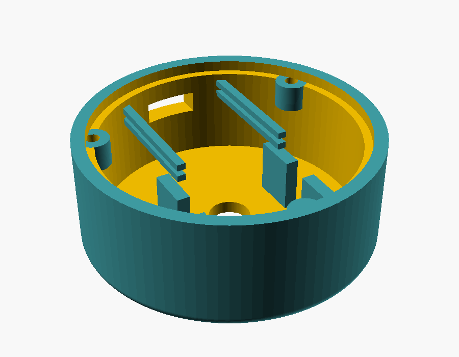

# Enclosure

A round desktop puck for the knob. Parametric OpenSCAD source plus exported
STLs.



| File | Part |
| --- | --- |
| `volknob-case.scad` | source, all parts selected with `-D part="…"` |
| `body.stl` | shell with the top face, board mounts and USB-C opening |
| `plate.stl` | bottom plate, three M3 screws |
| `knob.stl` | optional knob, most KY-040 kits already ship one |
| `fittest.stl` | 2 mm slice carrying the three critical fits |

With the default dimensions the puck comes out **Ø54.2 × 20.9 mm**. The
diameter is not a fixed number: it is derived from the boards, so correcting a
measurement below re-sizes the case automatically. Set `case_d_min` to force a
larger puck.

## Measure first

The model was drawn from nominal dimensions, not from your parts. Check these
with calipers and correct them at the top of the `.scad` file:

| Variable | Nominal | What it is |
| --- | --- | --- |
| `enc_off_y` | 6.0 | **shaft axis to KY-040 board centre** |
| `enc_pcb_x`, `enc_pcb_y` | 19.0 × 26.0 | KY-040 board outline |
| `enc_body_h` | 6.7 | encoder body height above the board |
| `bushing_h`, `nut_t` | 5.0, 2.2 | bushing length and nut thickness |
| `esp_pcb_x`, `esp_pcb_y` | 18.0 × 22.5 | ESP32-C3 Super Mini outline |
| `usb_w`, `usb_h` | 9.0 × 3.4 | USB-C receptacle |

`enc_off_y` matters most and the fit test cannot catch it. On most KY-040
boards the encoder sits at one end and the pin header at the other, so the
shaft is **not** in the middle of the board. Measure from the shaft axis to the
board centre; a smaller value gives a smaller case.

`top_t` must stay below `bushing_h - nut_t`, otherwise the nut runs out of
thread before it clamps. With the defaults that is 2.4 mm against a limit of
2.8 mm.

## Printing

FDM, 0.4 mm nozzle, 0.2 mm layers, 3 perimeters, 20 % infill.

- `body` — print upside down, top face on the bed. No supports. The USB-C
  opening bridges 9.6 mm, which prints cleanly at this size.
- `plate` — flat, as it comes.
- `knob` — open side down.

Print `fittest.stl` first. It is a 2 mm slice with the bushing hole, the USB-C
opening and a slot the thickness of the ESP32-C3 board. The bushing should pass
through without force and the board should slide into the slot without play. If
it binds, raise `clr`; if it rattles, lower it.

## Assembly

1. Push the encoder shaft through the top face from the inside, so the board
   sits between the four ribs, and tighten the M7 nut from the outside.
2. Slide the ESP32-C3 into the rails from below, USB-C towards the opening.
3. Wire the five leads. Keep the antenna end of the ESP32-C3 — the end opposite
   the USB-C jack — away from the metal encoder body.
4. Screw the bottom plate on with three M3 × 8 self-tapping screws and stick
   four rubber feet into the recesses. The feet matter: without them the puck
   turns on the desk instead of the shaft turning in it.

## Re-exporting

```bash
openscad -D 'part="body"'    -o body.stl    volknob-case.scad
openscad -D 'part="plate"'   -o plate.stl   volknob-case.scad
openscad -D 'part="knob"'    -o knob.stl    volknob-case.scad
openscad -D 'part="fittest"' -o fittest.stl volknob-case.scad
```

`part="assembly"` and `part="section"` render the stack for checking, they are
not meant for printing. The echo output prints the computed stack heights and
the derived diameter, which is the quickest way to see what a changed
measurement did.
